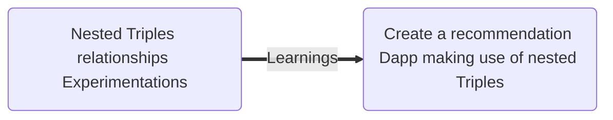
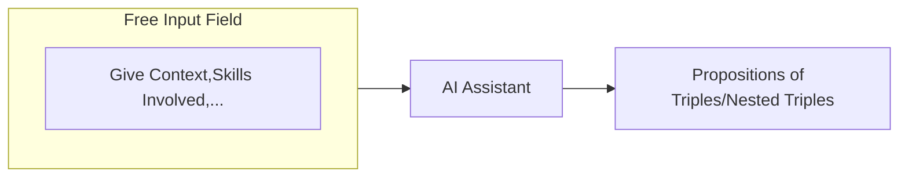
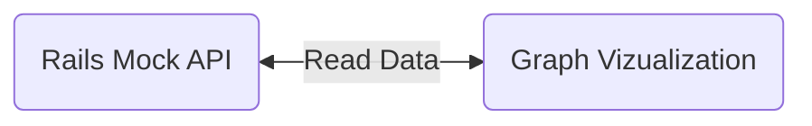
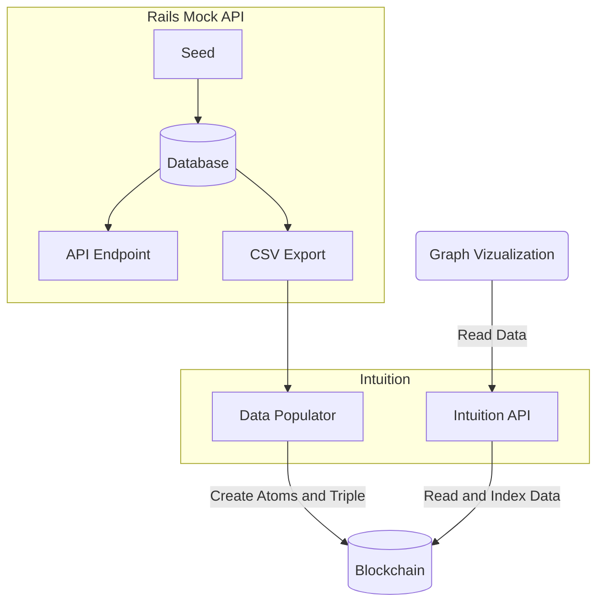

slug: Introduction-to-Intuition
title: Introduction to Intuition
authors: [Zealr, Mcdp]
tags: [intuition, thp-lab]

---

<!-- for some reason without this first empty title the one under doesn't show up -->

## Introduction 🚀

### About us 👨‍💻👩‍💻

We're a team of 5 developers in training from **The Hacking Project**, a Bootcamp school in France. The team is composed of **Sacha Godel**, **Thibault Lenormand**, **Alexandre Tedesco**, and **Thomas Bobichon**.  
This project is important to us, as it is the final project of our training which will validate our diploma! 🎓  
With us, there's **Jeremie**, aka **Zet**, who's advising us, as he is really familiar with Web3. ✨

### Our project : Hacking around Intuition 👨‍💻👩‍💻

We contacted the team working on **Intuition**, who are building a platform where you can create information on the **RDF model**, which you can find [here](https://www.w3.org/RDF/).  
On Intuition, you create an **Atom** in which you can stock any piece of information. For example, I can create an identity for myself and use it to make claims about me. When you link Atoms together by using one as the subject, a predicate, and an object, you get a **Triple**.

A simple example would be:  
_(Elon Musk) – (is CEO of) – (Tesla)_.  
With this, you can create claims and a real network of information. 🌐

**Intuition** uses the **Base Blockchain**, which guarantees that every piece of information is immutable and accessible to everyone, thanks to the history of transactions.

---

## Objectives 🎯

We've got two main objectives for this project:

### Nested Triples relationships Experimentations

1. **Make Triples related to each other** 🔗  
   For example: _(Sacha – has completed –(Fullstack (spring- 2024 – session) (of- THP- Bootcamp))_  
   You can see that several Triples are linked, creating deeper connections and cariing more semantic from one Triple.

2. **Visual experiments on a graph** 📊  
   Depending on its context and the data pointed, a user might have different need. For example show the list of the favorite books from within its close friens.

   We are thinking about options to :

   - apply filters
   - switch to different view mode ( 2D/3D/VR)
   - switch to differents grouping feature (list, triples, nested triples, ...)
   - allow for a quick change of perspective (main subject in the middle with its relations around it). This way, you can access a vast network of information starting from a single point.

### Create a recommendation Dapp making use of nested Triples

We want to provide an easy to use Dapp that allows users to :

- Create claims about themselves.
- Ask recomendations to their peers by specifing their intereset.
- Make recommendations and endorsement to others.

---

## Roadmap 🛣️

### Nested Triples relationships Experimentations

#### Step 1: Experiments and improvements 🔍

- [x] Create a mock list of nested Triples (student, school, skills,session) powered by a Rails API.
- [x] Create a React App Graph Vizualization to display the data from the Rails API.

#### Step 2: Bulk Triples creation 📑

- [x] Add a view to the Mock API to quiclky add new Triples or nested Triples
- [x] Allow the Graph vizualization to switch between the Rails API and the Intuition API.
- [ ] Generate a CSV file from the mocked data (Atom + Triples)
- [ ] PR on Intuition's **Data Populator** : add feature to bulk create Triple.

#### Step 4: Real data integration 🧑‍🎓

- [ ] Push our real school data (student, diplomas,sessions) into the Intuition protocol.

### Create a recommendation Dapp making use of nested Triples

---

## Components 🛠

### 1. Mock Rails API 🛡️

This component will be the basis for initial tests.  
Features:

- **Database seeds** to bootstrap data for a school, its students, and their relations.
- API to show a graph and visualize data.
- CSV file generation for Intuition's Data Populator.
- Add a **console** to create new Triples directly for faster testing.

### 2. Data Populator ⚙️

We aim to enhance the **Data Populator** by enabling it to create **Triples**, not just Atoms.

### 3. Visualization Graph (React) 📈

This graph will help visualize **Intuition data**, connected either to the Rails API or Intuition's SubGraph.

- Experiment by changing the main node to explore complex relationships.
- Support 2D, 3D views, lists, and more.

### Assistant 🤖

#### User who wants a recommendation:

1. Fill out a text field with details about the recommendation or attestation.
2. Create the attestation and send it to others for validation.

#### User who wants to give a recommendation:

1. Validate another user's request.
2. Deliver the recommendation.

Our backend will involve an **AI assistant** to create meaningful recommendations by finding the best ways to combine Triples. Other students can validate these claims to enhance credibility. 🌟

---

## Project Impact 📦

This project is **Open Source** 👐, so anyone is free to contribute. Once completed, we hope anyone can use this platform to create their own data.

One application we'd like to implement is for our school:

- A way to deliver attestations to students validating their skills.
- Other students or collaborators can **validate claims**, giving them even more credibility. 🛠️

---
