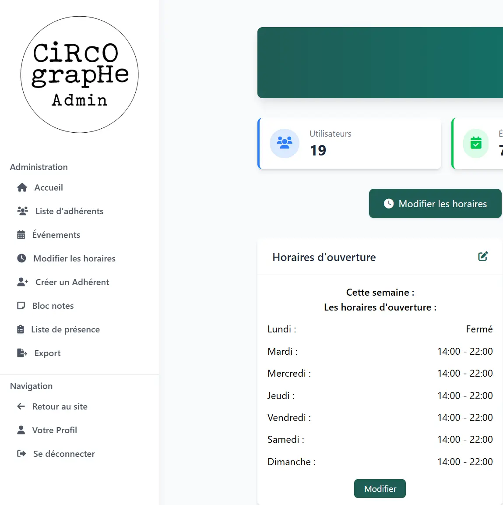

# Features Overview

Le Circographe offers a comprehensive set of features designed specifically for circus communities and organizations.

## Member Management

### Registration and Profiles

- **Member Profiles**: Maintain detailed profiles with contact information, skills, and interests
- **Digital Membership Cards**: Generate digital cards for quick identification
- **Custom Fields**: Configure additional fields based on your organization's needs
- **Member History**: Track activity, attendance, and participation

### Membership Plans

- **Subscription Management**: Create and manage different membership tiers
- **Payment Tracking**: Record and monitor payment status
- **Automated Reminders**: Send notifications for membership renewals

## Event Management

### Calendar

- **Event Scheduling**: Create and schedule classes, workshops, performances, and meetings
- **Resource Allocation**: Assign spaces, equipment, and instructors
- **Attendance Tracking**: Keep records of participation

### Registration

- **Online Registration**: Allow members to sign up for events
- **Capacity Management**: Set limits and waitlists
- **Payment Processing**: Handle fees for paid events

## Administrative Tools

### Dashboard

- **Key Metrics**: View important statistics at a glance
- **Membership Reports**: Generate reports on growth, retention, and demographics
- **Financial Summaries**: Track income from memberships and events

### User Permissions

- **Role-Based Access**: Define roles with specific permissions
- **Administrative Hierarchy**: Create organizational structure with appropriate access levels

## Public Website

### Public-Facing Content

- **About Pages**: Share your mission, history, and team
- **Event Calendar**: Showcase upcoming classes and performances
- **News and Updates**: Post announcements and news items

### Member Portal

- **Personal Dashboard**: Members can view their information, upcoming events, and payment status
- **Communication Tools**: Internal messaging and announcements
